# Sorting Algorithms Visual Guide

---

## A. Comparison-Based Sorts ($O(N^2)$)

These algorithms use **nested loops**:

* Outer loop → tracks sorted portion
* Inner loop → performs comparison and movement

---

## 1. Bubble Sort: "Neighbor-to-Neighbor"

**Idea:** Adjacent comparison. Largest element “bubbles” to the end.

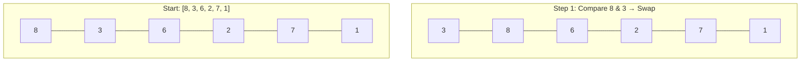
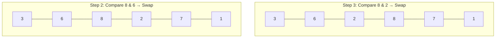
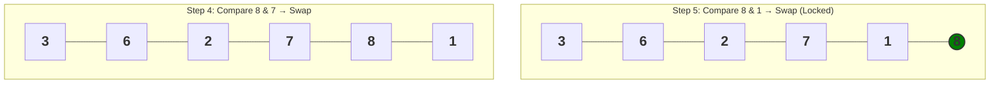

### Explanation

This shows **Pass 1 on `[8, 3, 6, 2, 7, 1]`**.

* `8` is compared with each neighbor
* It keeps swapping and moving right
* Finally, `8` reaches the last position and becomes fixed

Result after pass:

```
[3, 6, 2, 7, 1 | 8]
```

Each pass guarantees **one largest element is placed correctly**.

---

## 2. Selection Sort: "Search and Swap"

**Idea:** Find minimum → swap once → grow sorted section.

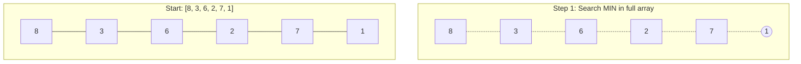
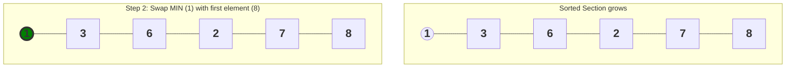

### Explanation

* Entire array is scanned → smallest element is `1`
* One swap happens → `1 ↔ 8`

Result:

```
[1 | 3, 6, 2, 7, 8]
```

* Sorted portion grows from left
* Only **one swap per pass**

---

## 3. Insertion Sort: "Shift and Slide"

**Idea:** Insert element into correct position in sorted section.

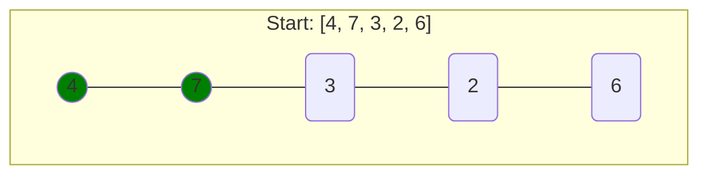
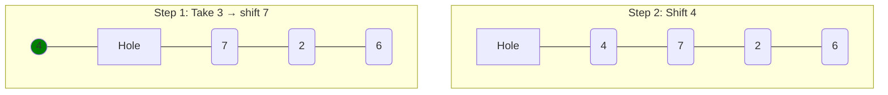
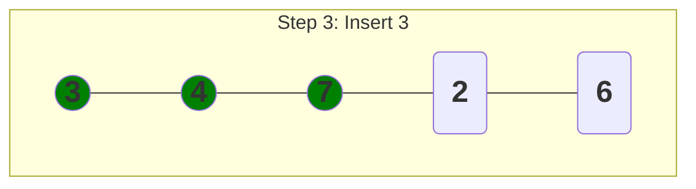

### Explanation

Start:

```
[4, 7 | 3, 2, 6]
```

* `3` is inserted into sorted portion
* Larger elements (`7`, `4`) are shifted right

Result:

```
[3, 4, 7 | 2, 6]
```

👉 Key point: **shifting, not swapping**

---

## B. Divide and Conquer Sorts ($O(N \log N)$)

These algorithms use **recursion** to break problems into smaller parts.

---

## 4. Merge Sort: "Split and Zip"

**Idea:** Split → recursively → merge sorted arrays.

### Divide Phase

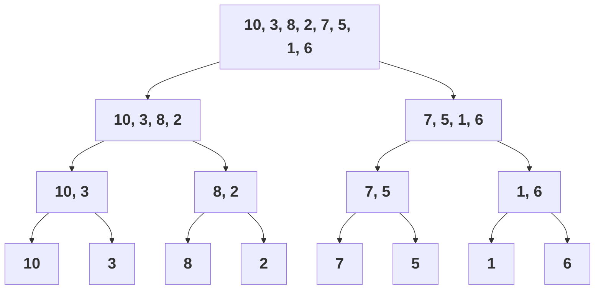

### Merge Phase

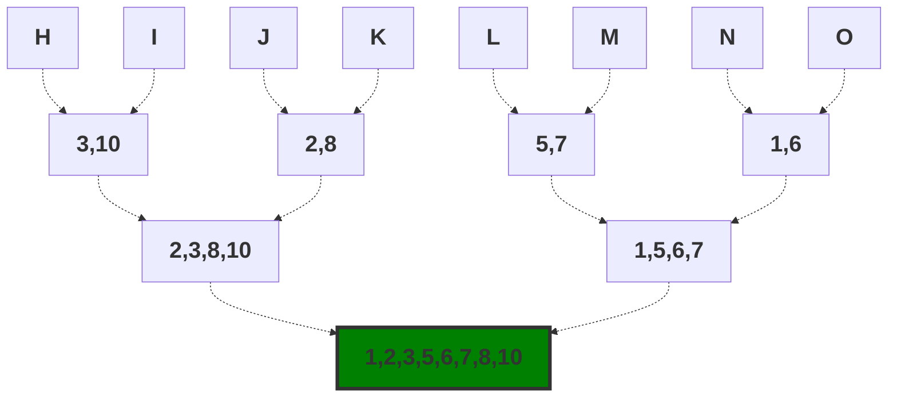

### Explanation

Start:

```
[10, 3, 8, 2, 7, 5, 1, 6]
```

* Split until single elements
* Merge step builds sorted arrays

Final result:

```
[1, 2, 3, 5, 6, 7, 8, 10]
```

👉 Sorting happens **during merging**

---

## 5. Quick Sort: "Pivot Partition"

**Idea:** Choose pivot → partition → recurse.

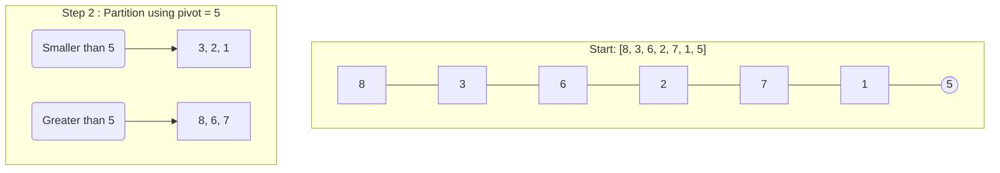
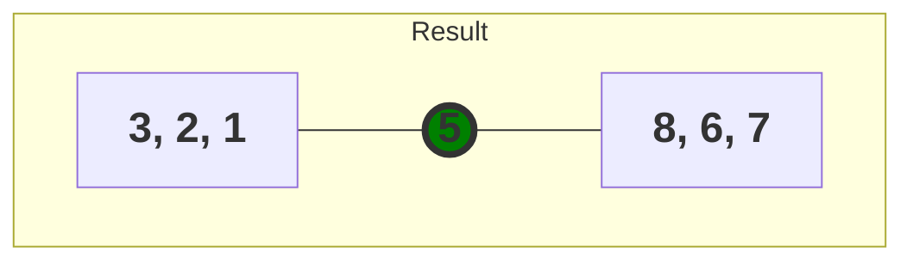

### Explanation

Start:

```
[8, 3, 6, 2, 7, 1, 5]
```

* Pivot = `5`
* Left → `[3, 2, 1]`
* Right → `[8, 6, 7]`

Result:

```
[3, 2, 1] | 5 | [8, 6, 7]
```

👉 Pivot is **already in final position**

---

## 🏁 Summary Comparison

| Algorithm      | Strategy        | Best Case  | Worst Case | Memory   |
|----------------|-----------------|------------|------------|----------|
| Bubble Sort    | Adjacent Swap   | O(N)       | O(N²)      | In-place |
| Selection Sort | Find Minimum    | O(N²)      | O(N²)      | In-place |
| Insertion Sort | Shift & Insert  | O(N)       | O(N²)      | In-place |
| Merge Sort     | Divide & Merge  | O(N log N) | O(N log N) | O(N)     |
| Quick Sort     | Pivot Partition | O(N log N) | O(N²)      | O(log N) |

---
